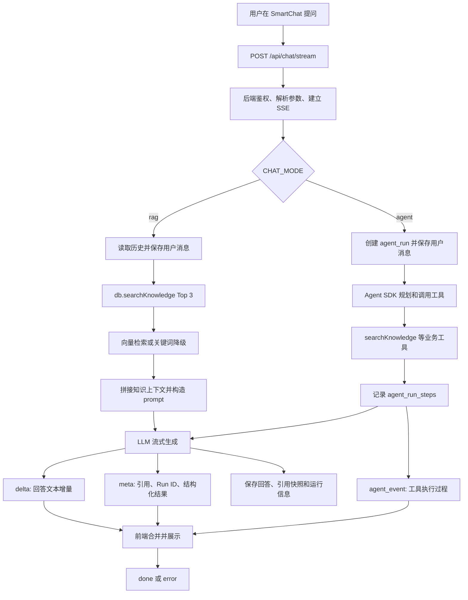

# Codex 会话总结：从前端提问到带引用答案返回

## 会话信息

- 原会话标题：`在这个项目中，在用户问一个问题后，从前端发请求到最终带来引用来源的答案返回，中间经历了哪些环节吗？`
- 本地会话 ID：`019f02d8-6513-7040-8ec1-fd65f4259e6a`
- 会话开始时间：2026-06-26
- 后续讨论时间：持续至 2026-06-28
- 本文用途：归纳该会话确认的系统现状、暴露的问题和提出的改进方案。

> 本文将“当前实现”和“建议方案”分开描述。除特别说明外，建议方案并不代表已经实现。

## 一、核心结论

用户在智能客服页面提问后，前端通过 `POST /api/chat/stream` 发起请求，并用 `fetch` 手动读取 SSE 流。后端完成鉴权后，根据 `CHAT_MODE` 进入直接 RAG 或 Agent 两条路径。两条路径都会检索知识库、生成回答，并通过不同类型的 SSE 消息分别返回正文、引用、Agent 过程和完成状态。

最终的“带引用答案”由两部分组成：

1. LLM 或 Agent 生成的回答正文，prompt 可能要求正文末尾列出参考标题。
2. 后端生成的结构化引用快照 `relatedKnowledge`，前端单独渲染为“参考知识库”。

因此，引用展示不依赖模型自行生成引用文本，后端持有一份可落库、可回显的结构化引用列表。

## 二、端到端处理链路



### 1. 前端交互与请求

主要入口是 `client/src/pages/SmartChat.tsx`：

- 先在本地加入用户消息和空的 assistant 占位消息。
- 使用 `fetch` 发送 `POST /api/chat/stream`，请求体包含用户问题。
- 使用 `response.body.getReader()` 持续读取并解析 SSE 数据。
- 收到 `delta` 时追加正文，收到 `meta` 时补充引用、Run ID 和结构化结果。
- Agent 模式下还会根据 `agent_event` 更新工具时间线。

聊天没有走普通的 tRPC mutation，是因为回答需要边生成边展示；其他常规数据请求仍主要使用 tRPC 和 React Query。

### 2. 后端 SSE 入口与模式分流

入口位于 `server/chatStream.ts`，主要职责包括：

- 设置 `text/event-stream` 响应头。
- 鉴权并解析 `content`、`ticketId` 等参数。
- 监听超时与客户端断开。
- 根据 `ENV.chatMode` 分流到直接 RAG 或 Agent。

分流关系可以概括为：

```text
CHAT_MODE=rag
  prepareChatResponse -> db.searchKnowledge -> streamLLM

CHAT_MODE=agent
  streamAgentChatResponse -> Agent SDK -> tools -> streamed output
```

Agent 不是位于前端和后端之间的独立服务，而是后端聊天流程中的决策与工具编排层。

### 3. 直接 RAG 路径

直接 RAG 的主要编排位于 `server/chatService.ts`：

1. 读取最近的聊天历史。
2. 保存用户消息。
3. 调用 `db.searchKnowledge(content, 3)`，固定召回 Top 3。
4. 将每条知识按 `[分类] 标题: 正文` 拼接为上下文。
5. 将拼接后的整体上下文截断到 6000 字符。
6. 构造 system prompt，要求模型依据知识库回答。
7. 调用 LLM 并把文本作为 `delta` 流式返回。
8. 保存 assistant 消息、模型信息、引用 ID 和引用快照。

RAG 模式的结构化引用在模型开始回答前就能确定，因此后端可以较早发送 `meta.relatedKnowledge`。

### 4. Agent 路径

Agent 路径主要位于 `server/agentService.ts`：

1. 执行输入 guardrail。
2. 创建 `agent_runs`，保存用户消息并更新运行状态。
3. 调用 OpenAI Agents SDK。
4. Agent 根据问题决定是否调用 `searchKnowledge`、`createTicket`、`listTickets`、`getTicketById`、`addTicketNote` 等工具。
5. 工具调用和结果记录为 `agent_run_steps`，并以 `agent_event` 推送给前端。
6. 模型生成的文本以 `delta` 推送。
7. 运行结束后，从 `searchKnowledge` 工具结果中提取引用快照，同时整理结构化结果。
8. 保存 assistant 消息、引用、Run metadata 和最终状态。

Agent 模式的引用依赖实际工具调用结果，所以 `meta` 通常要等 Agent 运行结束后才能完整发送。

### 5. 知识库检索

检索实现位于 `server/db.ts`，会优先尝试向量检索：

- Embedding 模型为 `BAAI/bge-small-zh-v1.5`，向量维度为 512。
- PostgreSQL 使用 pgvector 的 cosine distance。
- 对应操作符为 `<=>`，索引操作类为 `vector_cosine_ops`。
- 使用 HNSW 部分索引，只索引 embedding 非空的条目。
- 项目没有显式配置 `m`、`ef_construction` 和 `hnsw.ef_search`，使用 pgvector 默认值。
- Embedding 被禁用、调用失败或向量结果为空时，回退到关键词检索。

正式聊天的默认召回数量为：

```text
直接 RAG：固定 Top 3
Agent 工具：默认 Top 3，范围 1 到 5
RAG Debug：默认 5，仅用于调试
```

### 6. SSE 消息如何区分

当前实现没有使用 SSE 原生的命名事件 `event: delta`，而是在统一的 `data:` JSON 中使用 `type` 字段分流：

```text
data: {"type":"delta","content":"..."}
```

主要类型如下：

| `type` | 作用 |
| --- | --- |
| `agent_event` | Agent 思考或工具调用过程，用于工具时间线 |
| `delta` | LLM/Agent 文本增量，前端持续追加 |
| `meta` | `relatedKnowledge`、`runId`、`structuredOutput` 等元信息 |
| `done` | 流式回答完成 |
| `error` | 请求或运行失败 |

结构化结果和引用来源目前都放在 `meta` 中，并不是四条完全独立的传输通道。

## 三、会话中确认的问题与方案

### 问题 1：Top K 如何设置，是否应该不断增大

**现状**

- 直接 RAG 固定 Top 3。
- Agent 搜索默认 Top 3，最多 Top 5。
- 没有 rerank。

**风险**

- K 太小会漏掉必要证据。
- K 太大会引入噪声，增加 token、延迟和模型答偏的概率。
- 当前总上下文只有 6000 字符，增大 K 后，靠后的结果可能根本无法进入 prompt。

**会话提出的方案**

- 根据知识切分粒度、问题复杂度、上下文容量、召回质量、延迟和业务风险设置 K。
- 简单 FAQ 维持 1 到 3 条；复杂多条件问题可以取 5 条。
- 不要用增大 K 掩盖知识切分、关键词、Embedding 文本或阈值问题。
- 引入 rerank 后，可以先向量召回 Top 20，再重排取 Top 3 到 5 交给模型。
- 用 RAG Debug 和离线问答集评估 recall、answer quality、延迟和成本，再决定参数。

### 问题 2：知识上下文是全量拼接、重排还是截断

**现状**

- 召回结果按当前顺序直接拼接 `category/title/content`。
- 没有二阶段 rerank。
- 对拼接后的整体内容硬截断到 6000 字符。

**风险**

- 第一条知识很长时，第二、第三条可能被截掉。
- 硬截断可能切断条件、段落或句子，让模型看到不完整规则。
- 全量拼接虽完整，但会提高成本、延迟和噪声。

**会话提出的方案**

优先采用“每条限长 + 总预算 + 语义边界截断”：

```text
Top 3
总预算 6000 字符
每条最多约 1800 字符
其余预算留给标题、分类和分隔符
优先按段落或句子边界截断
```

随后再按需要增加 rerank 或 query-focused 摘要。

### 问题 3：关键词降级对上层和用户不可见

**现状**

`db.searchKnowledge` 只返回知识条目数组。向量检索失败时只有服务端日志，上层 `chatService`、Agent 和前端都不知道当前使用了关键词降级结果。

**风险**

- Agent/LLM 会把低置信的关键词召回当作正常向量召回。
- 用户无法判断答案质量是否下降。
- Agent Run 和前端难以定位召回异常。

**会话提出的方案**

让检索函数返回结果和检索元信息：

```ts
type KnowledgeSearchResult = {
  entries: KnowledgeBase[];
  retrieval: {
    mode: "vector" | "keyword";
    degraded: boolean;
    fallbackReason?:
      | "embedding_disabled"
      | "vector_error"
      | "no_vector_results";
  };
};
```

并分层传播：

- 向 LLM：在 prompt 中说明当前是降级检索，要求依据不足时保守回答。
- 向 Agent：在 `searchKnowledge` 工具结果中返回 `retrieval`。
- 向前端：在 SSE `meta` 中返回降级状态，显示温和的人工确认提示。
- 向开发者：在日志、Agent Run 和 telemetry 中保留完整 `fallbackReason`。

关键点是不能只在 UI 提示，模型和 Agent 也必须感知降级态。

### 问题 4：模型幻觉出无权访问的工单 ID

**现状与已有防护**

模型参数不被信任。`getTicketById` 和 `addTicketNote` 在执行数据库读写前都会调用 `ensureTicketAccess`：

- 工单不存在时抛出“工单不存在”。
- 普通用户访问他人工单时抛出“无权访问该工单”。
- 只有管理员或工单所属用户可以继续读写。
- 权限检查通过后才读取备注或写入备注。

工具的 `errorFunction` 会把权限错误转换成模型可理解的工具失败，让 Agent 向用户说明无法访问。

**结论**

幻觉 ID 最多造成工具失败和错误 Step，不会越权读取或修改他人工单。需要继续坚持“参数校验 + 工具执行层权限校验”，不能依赖模型自律。

### 问题 5：SSE 中途断线不能续传

**现状**

- 已收到的 `delta` 保留在当前页面内存中。
- 前端报错后停止 streaming，并提供重试按钮。
- 重试会重新发送原问题，不会从断点继续。
- 后端在连接关闭时触发 `AbortController`，终止当前 LLM/Agent 调用。
- 半截 assistant 回答通常不会落库。
- Agent 已产生的部分 Run/Step 可能已经落库，Run 通常会失败。
- 没有 `Last-Event-ID`、事件序号、事件缓存或重连补发。

**会话提出的目标架构**

Agent 生命周期应与 SSE 连接解耦：

```text
POST /api/chat/start
  创建持久化 run，并把任务交给后台 worker

GET /api/chat/stream/:runId?afterSeq=18
  补发 seq > 18 的历史事件，再订阅新事件
```

新增持久化事件日志：

```text
agent_run_events
- id
- run_id
- seq
- type: agent_event / delta / meta / done / error
- payload
- created_at
```

推荐让事件日志成为过程事实来源，`chat_messages` 作为完成后的展示快照。前端断线只中断观察，后台 Agent 继续执行；重连时使用 `runId + afterSeq` 或 SSE `Last-Event-ID` 续传。

如果还需要在 worker 崩溃或机器重启后恢复，则必须增加 checkpoint，持久化已完成步骤、工具结果、模型上下文、当前输出和下一步状态，或使用 Temporal、LangGraph checkpoint 等 durable workflow 能力。

### 问题 6：多个工具中一个失败时是否整体回滚

**现状**

- 工具内部错误通常由 `errorFunction` 转成 Agent 可见的错误结果，Agent 可以带着前面成功的结果继续推理。
- 如果错误冒泡到外层，整个 `agent_run` 会被标记为 `failed`。
- 无论 Run 是否失败，都没有全局数据库事务回滚。
- 已创建的工单、已添加的备注、已保存的 Step 和已发出的 `delta` 不会自动撤销。

**结论与方案方向**

当前语义是“尽量使用部分结果继续”，不是“全局失败回滚”。对查询型工具可以安全重试；对有副作用的工具，需要幂等或补偿机制，不能假定 Run 失败会撤销副作用。

### 问题 7：当前重试是整次 Run 重跑，可能重复副作用

**现状**

- 聊天页重试会重新发送原问题。
- Run 详情页重试会创建新 Run，并用 `retryOfRunId` 关联旧 Run。
- 系统不会只重试失败工具，也不会复用之前成功的工具结果。
- `createTicket` 当前是普通 insert，`tickets` 表没有幂等键或来源 Run/Step 字段。

**风险**

整次 Run 重跑时，模型可能再次调用 `createTicket` 或 `addTicketNote`，导致重复创建工单或重复写备注。

**会话提出的方案**

先为副作用工具增加稳定幂等能力，可新增 `agent_tool_invocations`：

```text
- id
- root_run_id
- run_id
- tool_call_id
- tool_name
- args_hash
- idempotency_key unique
- status
- result
- error
```

同一个幂等键再次执行时，应直接返回之前的结果。单 Run 内可使用 `runId + toolCallId`；要支持跨重试 Run 去重，则使用 `rootRunId + toolName + normalizedArgsHash` 一类更稳定的键。

### 问题 8：缺少单工具重试、Step Resume 和 Partial Replay

**现状**

`agent_runs` 和 `agent_run_steps` 足以审计，但还不足以恢复执行。Step 缺少稳定工具调用标识、完整参数、完整结果、执行状态和幂等信息。

**会话提出的方案**

扩展 Step 或工具调用记录：

```text
tool_call_id
tool_name
args_json
result_json
status: pending/running/succeeded/failed/skipped
retry_count
idempotency_key
seq
```

三类能力分别依赖：

- 单工具 retry：读取失败 Step 的工具名和参数，只重新执行该工具。
- partial replay：成功工具直接复用历史结果，不再次执行副作用。
- step resume：把已完成步骤和重试成功的工具结果重新注入 Agent 上下文，从失败点之后继续。

如果 SDK 不支持精确恢复，可以先采用应用层 replay：新建一个关联旧 Run 的恢复 Run，把已完成结果写入上下文，并由幂等执行器阻止重复副作用。更复杂的场景再升级为可 checkpoint 的工作流引擎。

### 问题 9：是否能改用原生 EventSource

**现状**

当前接口是带 JSON body 的 `POST /api/chat/stream`，原生 `EventSource` 只支持 GET，因此前端使用 `fetch + ReadableStream`。

**会话提出的方案**

如果采用前述“创建 Run + 订阅 Run”架构，可以改为：

```text
POST /api/chat/start          提交问题并返回 runId
GET  /api/chat/stream/:runId  EventSource 订阅
```

EventSource 可以获得自动重连和 `Last-Event-ID` 支持，但只能 GET、不方便设置自定义 header，认证通常依赖 Cookie。是否切换应与断线续传方案一起决定，而不是只替换前端读取 API。

## 四、建议的落地顺序

会话最终形成的优先级可以整理为：

1. **先解决副作用幂等**：覆盖 `createTicket` 和 `addTicketNote`，避免整 Run 重试制造重复数据。
2. **让检索降级可观测**：统一返回 `retrieval.mode/degraded/fallbackReason`，传给 Agent、LLM、SSE 和 Run 日志。
3. **改善 RAG 上下文预算**：从整体硬截断改为每条限长、总预算和语义边界截断。
4. **增强 Step 数据结构**：保存稳定 `toolCallId`、结构化 args/result、状态、序号和重试次数。
5. **执行与 SSE 解耦**：后台持久化 Run，新增事件日志和按序号补发能力。
6. **实现单工具 retry 和应用层 resume**：先复用成功结果，再从失败点继续生成答案。
7. **基于评测优化检索**：建立离线问答集，评估 Top K、阈值、HNSW 参数，并按需要加入 rerank。

## 五、系统边界总结

- Agent 是后端编排层，不是前端直连服务。
- RAG 在直接模式下是固定前置步骤，在 Agent 模式下是可调用工具。
- 正文和结构化引用是两条逻辑数据：正文走 `delta`，引用走 `meta.relatedKnowledge`。
- 当前检索可以降级，但降级状态没有进入正式聊天链路。
- 当前 SSE 支持流式展示，不支持可靠续传。
- 当前工具错误可以局部消化，但没有事务式全局回滚。
- 当前重试是整 Run 重跑，副作用工具尚缺少幂等保护。
- 要实现可靠恢复，需要把 Run、事件、工具调用结果和 SSE 订阅从请求生命周期中解耦。

## 六、涉及的主要文件

- `client/src/pages/SmartChat.tsx`：发送问题、解析 SSE、合并消息、展示引用和 Agent 时间线。
- `server/chatStream.ts`：SSE 入口、鉴权、模式分流、事件发送、断开处理。
- `server/chatService.ts`：直接 RAG 编排、历史消息、知识上下文和 prompt。
- `server/agentService.ts`：Agent Run、工具定义、权限检查、Step、结构化结果和引用提取。
- `server/db.ts`：知识检索、聊天记录、工单、Agent Run/Step 数据访问。
- `drizzle/schema.ts`：向量字段、HNSW 索引、工单和 Agent Run 数据模型。

