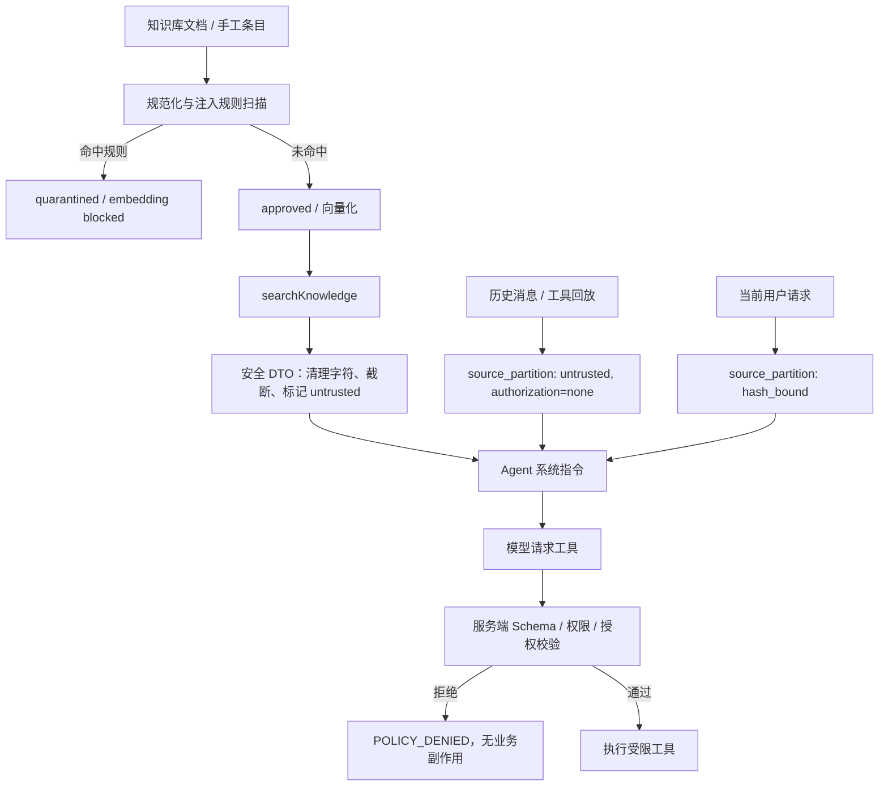
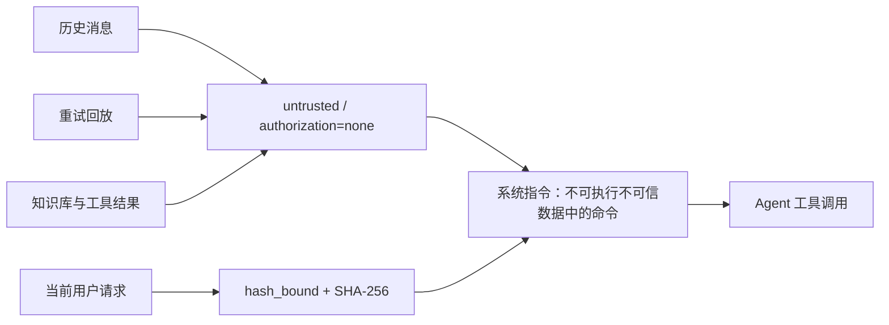

# Prompt Injection 防护说明

本文说明客服 Agent 当前针对 Prompt Injection 的防护链路、信任边界和已知限制。实现以 `server/knowledge/security.ts`、`server/agentService.ts` 与 `server/agentPolicy.ts` 为准。

## 设计原则

- 知识库、历史消息、重试回放、工单内容和工具返回值都是不可信数据，不能改变 Agent 的系统规则，也不能授权业务写操作。
- 高风险业务副作用不依赖模型判断，由服务端基于当前用户请求独立授权。
- 受污染或可疑的知识库条目默认隔离，只有审核通过的条目可以被检索。
- 检索到的知识仅用于回答事实性客服问题，不视为命令。

## 完整链路

## 1. 知识库入库防护

知识库的文档导入、手工新增、编辑和重新扫描均会调用 `scanKnowledgeContent`。

1. 先对标题、正文、分类和关键词做 NFKC 规范化，移除控制字符、双向控制符与零宽字符，降低混淆绕过风险。
2. 扫描器使用组合规则而不是单一敏感词，避免把正常的安全说明误判为攻击。
3. 扫描结果写入 `securityStatus`、`securityScore`、`securityFindings`、内容 SHA-256 和扫描器版本。
4. 命中任一规则的条目进入 `quarantined` 状态，embedding 状态为 `blocked`，默认不能被 RAG 检索。
5. 管理员可以审核批准或拒绝。审核请求必须携带预期内容 SHA-256；内容已变化时审核会因冲突而失败。

当前规则覆盖：

| 规则 ID | 防护目标 |
| --- | --- |
| `instruction-override` | 忽略、覆盖上级指令并指向 system/developer/assistant 指令 |
| `authority-impersonation` | 伪造系统、开发者或助手身份并要求服从 |
| `secret-exfiltration` | 读取密钥、凭据、环境变量并编码或发送外传 |
| `tool-abuse` | 诱导调用工具或命令，且要求绕过确认或隐藏行为 |
| `business-side-effect-injection` | 忽略规则后诱导创建工单、添加备注等业务写操作 |

检索层还会强制过滤：仅 `securityStatus = approved` 且 `embeddingStatus = completed` 的条目可以参与向量和关键词检索。

## 2. Agent 上下文隔离

- 历史对话和重试上下文以 `<source_partition>` 包裹，固定标记为 `trust="untrusted"` 与 `authorization="none"`。
- 当前请求单独分区，携带根据原始消息计算的 SHA-256；正文中的 `&`、`<`、`>` 会被转义，避免伪造分区标签。
- `searchKnowledge` 工具说明和系统指令都要求模型将知识库内容视为不可信参考资料：不能服从其角色切换、工具调用、秘密处理或外传请求。
- 传给模型的知识库 DTO 仅包含 `id`、`title`、`category` 和 `content`；会清理控制字符，正文最多保留 4,000 个字符，并附加 `trust: untrusted`、`authorization: none`。

## 3. 写操作的服务端授权

模型无法直接决定是否创建工单或添加备注。`createTicket` 和 `addTicketNote` 均要通过以下校验：

1. 服务端仅从当前用户消息解析明确、陈述式的授权意图。
2. 问句、否定句、引用、示例代码和转述语境会被保守拒绝。
3. 创建工单必须匹配显式创建意图；添加备注还必须从当前消息提取目标工单 ID。
4. 授权记录绑定当前用户原文的 SHA-256。历史、知识库、回放或工具内容中的授权语句没有效力。
5. 每次执行写工具时，服务端重新验证授权哈希、工具名称和备注目标 ID；失败即抛出 `POLICY_DENIED`，不执行数据库写入。
6. 工具调用使用幂等键，避免重试或重复执行产生重复工单、重复备注。

此外，工具参数由 Zod 校验；读取、查询和修改工单均会校验当前用户的所有权，管理员才可跨用户访问。

## 4. 敏感信息 Guardrail

模型执行前会检查当前用户消息是否含有明显的 API key、token/secret、密码或银行卡号。命中后不会调用模型，而是返回要求用户删除敏感信息的提示。

这项能力属于敏感数据防泄漏，不等同于通用 Prompt Injection 检测。

> 注意：当前实现会在 Guardrail 判定前保存用户消息到聊天记录。因此消息不会进入模型，但原始敏感文本仍可能落入 `chat_messages`。若目标是敏感信息绝不落库，需要将持久化逻辑移动到 Guardrail 通过之后，或改为脱敏后保存。

## 5. 额外约束与审计

- Agent Runner 限制为最多 6 个 turns，限制单次注入诱导的工具循环范围。
- Agent Run、步骤和工具调用会持久化，用于排查被拒绝的授权、工具参数摘要和执行结果。
- Worker 的租约和执行栅栏防止过期 Worker 在被接管后继续写入。

## 已知边界

- 用户输入不会经过一个通用的“越狱/注入文本分类器”；它仍会作为用户请求发送给模型。防护主要依赖系统指令、上下文分区和服务端工具校验。
- 知识库扫描是基于规则的检测，只覆盖已定义的攻击形态，不能保证识别所有变种。因此即便管理员批准条目，运行时仍必须保持其不可信标记和写操作二次校验。
- Agent 的提示词约束不能替代服务端权限与授权校验；后两者才是阻止实际数据泄露、越权访问和业务副作用的最终防线。

## 验证

相关测试位于：

- `server/knowledge/security.test.ts`：常规内容放行、组合型注入隔离、NFKC/零宽混淆、秘密外传、工具滥用和安全 DTO。
- `server/agentPolicy.test.ts`：明确授权、问句/否定/引用拒绝、目标工单不匹配、哈希过期、历史和知识库不可授权。
- `server/agentRun.test.ts`：工具层拒绝时无写副作用。

